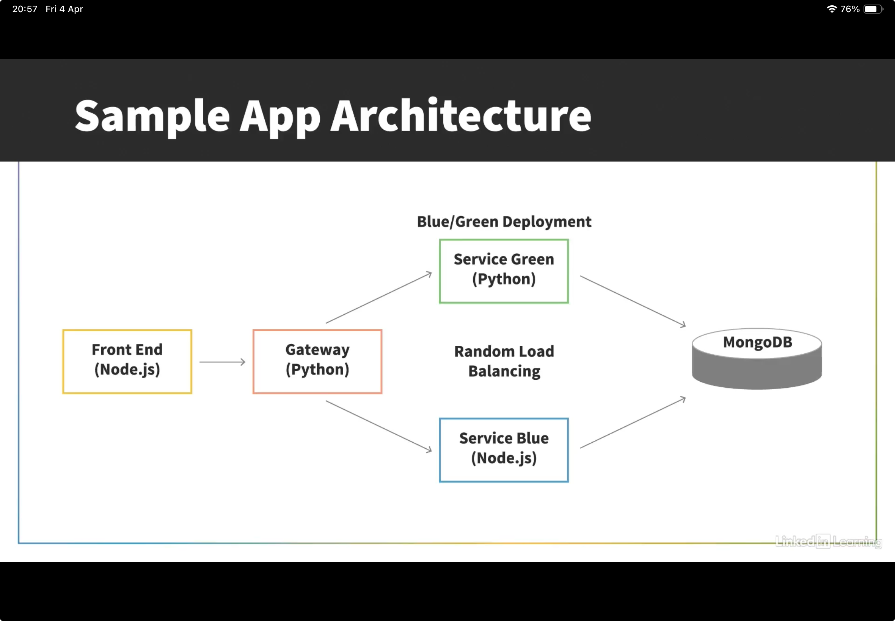
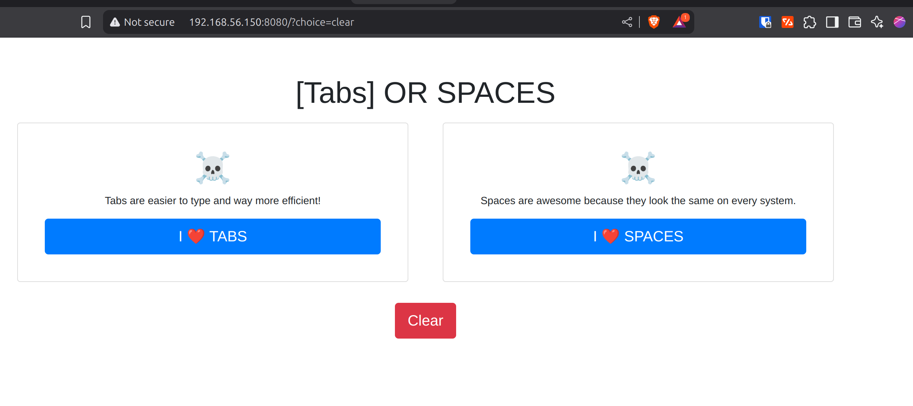

Lab Setup:
1. Install node.js using install-nvm.sh

2. Download & Install MongoDB . 

3. Run node-frontend
```
cd node-frontend
npm install 
npm start
this listens port 8080
```

4. Run node-service-blue
```
npm install 
npm start
this listens port 3020
```

5. Run python-service-gateway
```
flask run port 3001
```

6. Run python-service-greeen
```
flask run port 3010
```
7. IF all works fine, you should be see succesful frontend page. 
