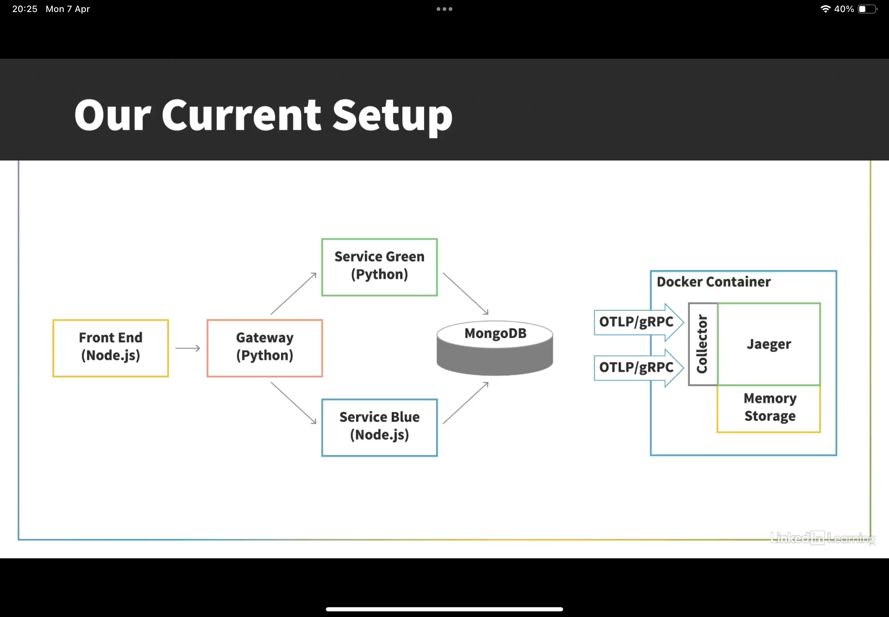
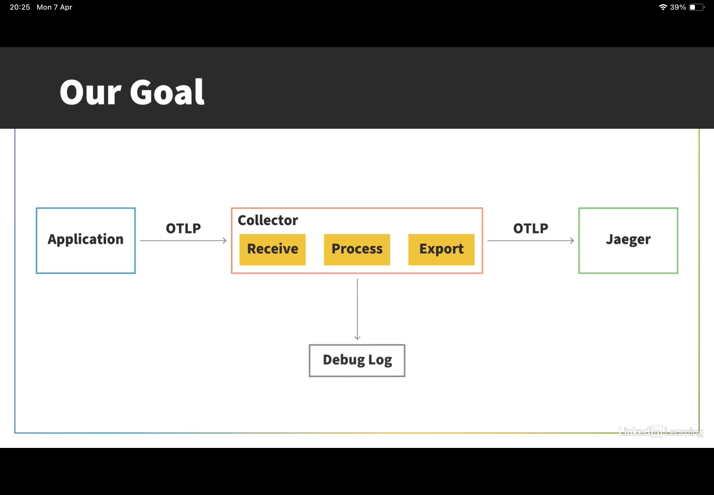

collector :

collect logs and process it and sent to backend to avoid latency. 

download and install otelcol-contrib from github releases.

installed as systemd service. 

config file created in /etc/otelcol-contrib

Before Collector setup

After Collector setup
